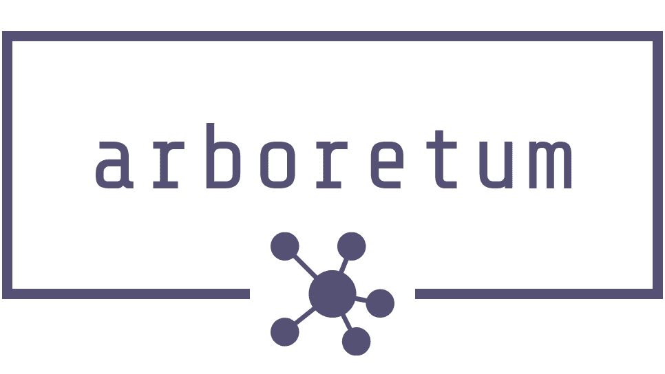

<div style="text-align:center;">
	
</div>

**arboretum** is a  graph library and CLI for computing tree decompositions.
Various state of the art preprocessing, graph reductions, exact and heuristic algorithms for obtaining tree decompositions are implemented.
# Features

* Well known fast heuristics such as min-degree and min-fill [[1]](#1)
* Metaheuristics such as tabu-local search [[3]](#3)
* Minor-min-width lowerbound heuristic [[4]](#4)
* Rule-based preprocessing for reducing graphs and obtaining tree-decompositions of graphs of treewidth ≤ 3 [[5]](#5)
* Graph decomposition based on the notion of safe separators [[6]](#6)
* A state-of-the-art exact algorithm [[8]](#8)

# The CLI
## Build
As **arboretum** is implemented in rust, the CLI can simply be built via cargo

```cargo build --release --features="cli"```

## Usage

Using a graph in [.gr format](https://pacechallenge.org/2021/) the program can be used as follows
```
cargo run --release --features="cli" < <graph.gr>
```
or
```
./target/release/arboretum-cli < <graph.gr>
```
The CLI makes automated choices about which algorithms to use based on the input graph, but without the heuristic flag will always try to find an exact solution.

Available CLI arguments:

```
USAGE:
    arboretum-cli [OPTIONS] [ARGS]

FLAGS:
    -h, --help       Prints help information
    -V, --version    Prints version information

OPTIONS:
    -m, --mode <mode>          Mode. 'heuristic', 'exact' or 'auto'. Defaults to Exact. Any invalid input fails silently
                               to 'heuristic'
    -s, --seed <seed>          Seed used for all rng. Unsigned 64bit integer value. Defaults to '0' if missing
    -t, --timeout <timeout>    Optional timeout value for heuristic algorithm. In heuristic mode the CLI stops on ctrl+c
                               and outputs the current best solution. This might take a few seconds or minutes depending
                               on the size of the input graph. When timeout is set, the algorithm tries to optimize a
                               solution until the timeout is reached
```


```cargo build --release```

# The Library
## Usage

Simply add **arboretum** to your projects `cargo.toml` under dependencies and get started. For documentation refer to the [docs.rs](https://docs.rs/arboretum).

# References

<a id="1">[1]</a> 
Hans L. Bodlaender and Arie M. C. A. Koster. 2010. Treewidth computations I. Upper bounds. Inf. Comput. 208, 3 (March, 2010), 259–275. DOI:https://doi.org/10.1016/j.ic.2009.03.008

<a id="2">[2]</a> 
Bannach, Max & Berndt, Sebastian & Ehlers, Thorsten. (2017). Jdrasil: A Modular Library for Computing Tree Decompositions. 10.4230/LIPIcs.SEA.2017.28. 

<a id="3">[3]</a> 
Hammerl T., Musliu N., Schafhauser W. (2015) Metaheuristic Algorithms and Tree Decomposition. In: Kacprzyk J., Pedrycz W. (eds) Springer Handbook of Computational Intelligence. Springer Handbooks. Springer, Berlin, Heidelberg. https://doi.org/10.1007/978-3-662-43505-2_64

<a id="4">[4]</a> 
Bodlaender H.L., Koster A.M.C.A., Wolle T. (2004) Contraction and Treewidth Lower Bounds. In: Albers S., Radzik T. (eds) Algorithms – ESA 2004. ESA 2004. Lecture Notes in Computer Science, vol 3221. Springer, Berlin, Heidelberg. https://doi.org/10.1007/978-3-540-30140-0_56

<a id="5">[5]</a> 
Eijkhof, Frank & Bodlaender, Hans. (2002). Safe Reduction Rules for Weighted Treewidth. 176-185. 

<a id="6">[6]</a> 
Hans L. Bodlaender, Arie M.C.A. Koster,
Safe separators for treewidth,
Discrete Mathematics,
Volume 306, Issue 3,
2006,
Pages 337-350,
ISSN 0012-365X,
https://doi.org/10.1016/j.disc.2005.12.017.

<a id="7">[7]</a> 
Dell, Holger, Komusiewicz, Christian, Talmon, Nimrod, Weller, Mathias
"The PACE 2017 Parameterized Algorithms and Computational Experiments Challenge: The Second Iteration" (2018) DOI: 10.4230/LIPIcs.IPEC.2017.30

<a id="8">[8]</a> 
Tamaki, H.. “Positive-instance driven dynamic programming for treewidth.” ESA (2017).

<a id="9">[9]</a> 
Bannach, Max and Sebastian Berndt. “Positive-Instance Driven Dynamic Programming for Graph Searching.” WADS (2019).

# License
This Software is licensed under the MIT-License which can be found in the `LICENSE` file in this repository.

